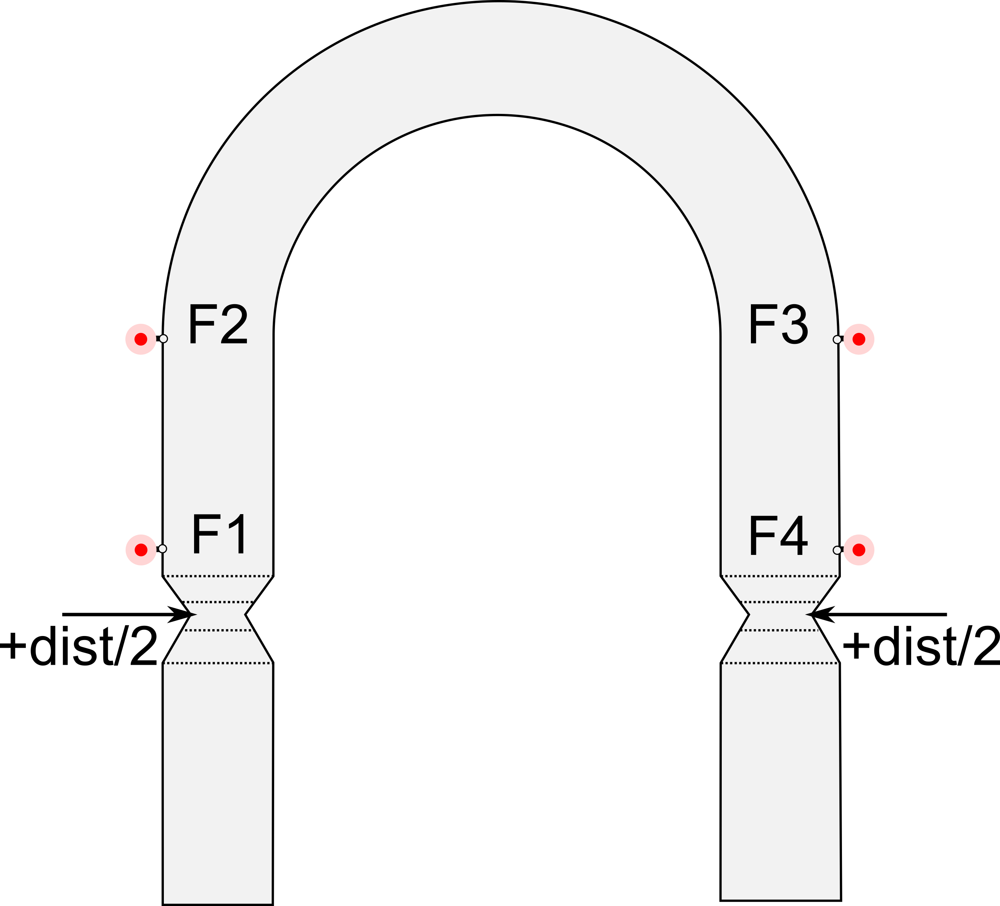
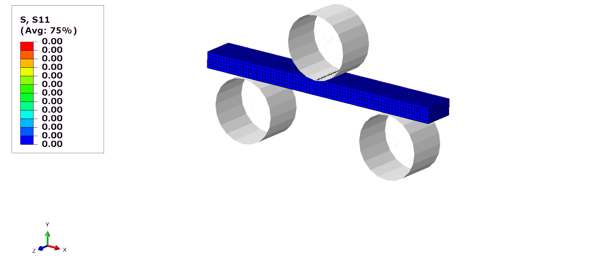

# Examples

Two example components have been provided with different sources of stress. The first reflects a U-shaped flexure which can be externally loaded, and the second a U-bend with plastically imposed residual stress.

The sequence for modelling these stresses takes the form of an overarching `packager*.py`. Each packager performs operations pertaining to generating a partitioned mesh with necessary sets for the application of boundary conditions by calling an ABAQUS Python script, denoted as `build_model*.py`. The output from this script then has physics, initial and boundary conditions appended, and is then submitted to ABAQUS or CalculiX to be solved. Once this has completed, then the appropriate post-processing script `*_access.py` is executed, to provide the resulting model in a format that can be used in the main application. **NB: all `packager*.py` files will erase any files that appear in the directory of execution that do not have extensions of '.dat', '.odb', '.py', '.vtu', '.STEP', '.inp' or '.txt'.**

All requisite scripts are located in the `OpenRS\generate` directory of this repository. What follows is a detailed description of how each operates and the options available for execution.

## U-flexure

Two routes have been developed for generating a model which contains stresses associated with applied stresses of either tension or compression on a U-shaped component. Geometry can be found in the `OpenRS\geometry` directory, with an OpenSCAD script for generating `*.stl` files, which can subsequently be converted to `*.STEP` files with FreeCAD. The geometry file `U_elastic_imp_fid.STEP` has been provided if geometry is not needed to be generated from source. NB: the associated `build_model*.py` script relies on the features present in the provided geometry.

### ABAQUS

* `packager.py`
Python 3 syntax; accepts arguments for a STEP file described above, mesh density (nominal element length), intermediate input file names, an output directory for the results of postprocessing. A single boundary condition of `disp` will elastically load the component.

The following image describes `disp` and fiducial point sequence available after post-processing:

* `build_model.py`

ABAQUS Python; called by `packager.py` to generate a raw mesh file with an `*.inp` extension. This mesh file only contains nodal coordinates, element definitions and geometric sets for the application of boundary conditions.

* `odb_access.py`

ABAQUS Python; called by `packager.py`. Operates on the output database file `*.odb` generated by ABAQUS. The output is the main stress components (S11, S22 and S33) assessed at nodal locations of the *deformed* mesh, in the form of either a legacy VTK file (`*.vtk`) or a text/ASCII-based XML-based, VTK unstructured mesh file (`*.vtu`) format. This format is required by the main application. Additionally, a text file is generated which contains the locations of fiducial points, as specified in the above image.

### CalculiX

* `packager_ccx.py`

Python 3 syntax; mirrors the solution and postprocessing sequence provided by `packager.py`. Operates on the output generated by `build_model.py`. Does not contain any inputs pertaining to mesh density as this is (currently) defined by ABAQUS, however does have an additional requirement of needing a full path to the main CalculiX executable as an argument.

* `frd_access.py`

Python 3 syntax, called by `packager_cxx.py`. Performs identically to `odb_access.py` on CalculiX's `*.frd` files.

## U-bend

Currently can only be generated from source with ABAQUS. The generation sequence mirrors that of the flexure described above, however different scripts have been employed on the basis that there are more components involved.

* `packager_plastic.py`

Python 3 syntax. Accepts an argument for mesh density, and the extent of travel of the central roller as shown here:

First calls `build_model_plastic.py`, which will generate surfaces and mesh corresponding to the three rollers and a meshed blank to a raw mesh file with a `*.inp` extension. Physics (material properties, surface interactions etcetera) are then appended at the end of this file and then submitted to the ABAQUS solver. The results are then processed by `odb_access_plastic.py`.

* `build_model_plastic.py`

ABAQUS Python script - builds geometry corresponding to ISO 5173, with parametric parameters pertaining to roller size, blank size and roller clearance.

* `odb_access_plastic.py`

ABAQUS Python script to generate a VTK file, similar to the method described in `odb_access.py`. *NB: not interchangeable with `odb_access.py`*