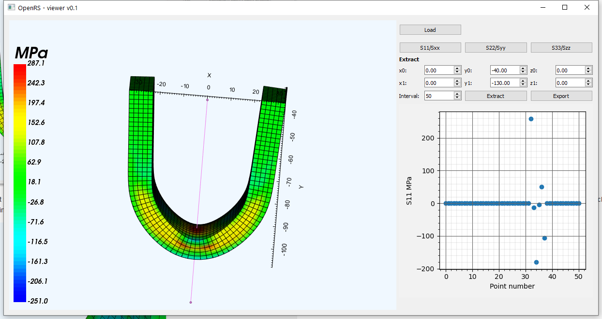

# Main application

Launch the main application at the command line with:

~~~
python -m OpenRS.viewer
~~~

This will run the OpenRS viewer as a script directly from the command line. Once launched, pressing the `Load` button will open a file dialog to open a `*.vtu` file. This file needs to contain an ASCII-XML VTK unstructured mesh, with stress data entered as VTK PointData DataArrays - see `OpenRS\examples` to see what this format looks like, along with VTK documentation. These files can be generated directly from commercial or open source finite element analysis software - see [examples](examples.md).

After a valid file is selected, the display will not immediately update, however the full path to the selected `*.vtu` file will be shown beside the `Load` button. Pressing any of the `S11/Sxx`, `S22/Syy` or `S33/Szz` buttons will update the display. For example:

Selecting each of the different stresses can be viewed by pressing the associated button. The model can be navigated by left clicking on the left-hand interaction space, and then further left clicking and dragging to rotate, right clicking and dragging to zoom (or mouse-wheel) and middle button and dragging for panning. This is shown here:

Stresses as they appear along a line can be extracted in the 'Extract' panel. The line is defined as `x0`, `y0` and `z0` denote the starting point, and `x1`, `y1` and `z1` the end. Clicking the `Extract` button will update both the model interaction panel on the left by showing this line, and generate a plot on the right of the stress that occurs over this line segment. The number of points to extract over the line length defaults to 50, but can be changed with the `Interval` selection. The following shows an example of this:

The line definition and resulting plot is updated by clicking the `Extract` button again after changes, which will in turn update the interaction and plot. Clicking on the `Export` button opens a file dialog to permit saving the data immediately displayed in the plot as a `*.csv` file.