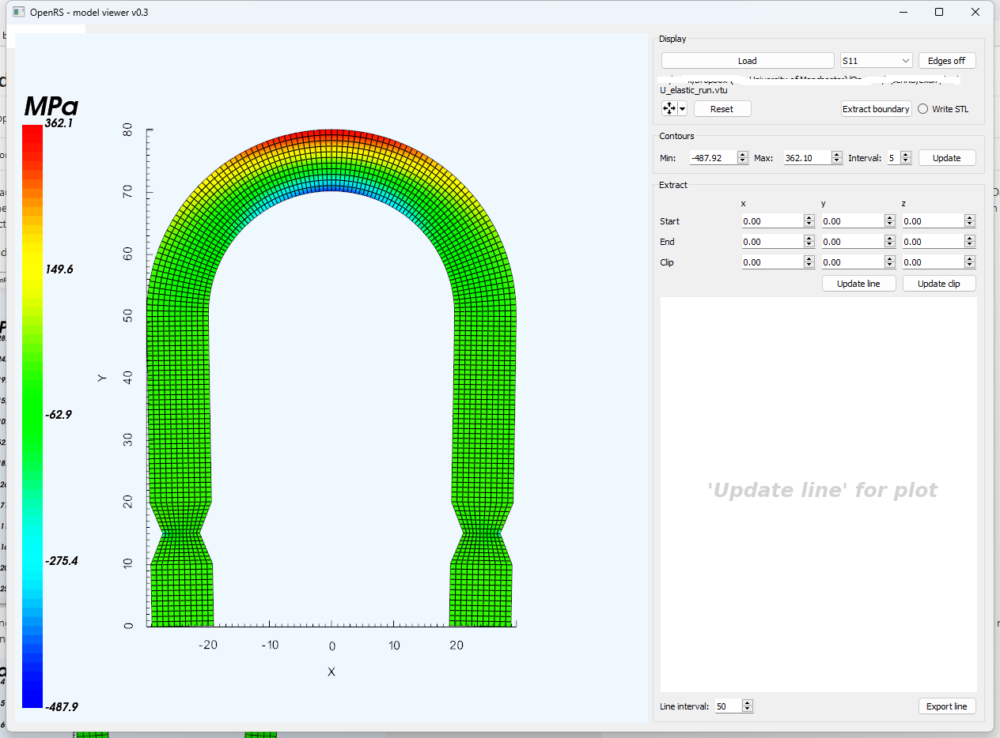
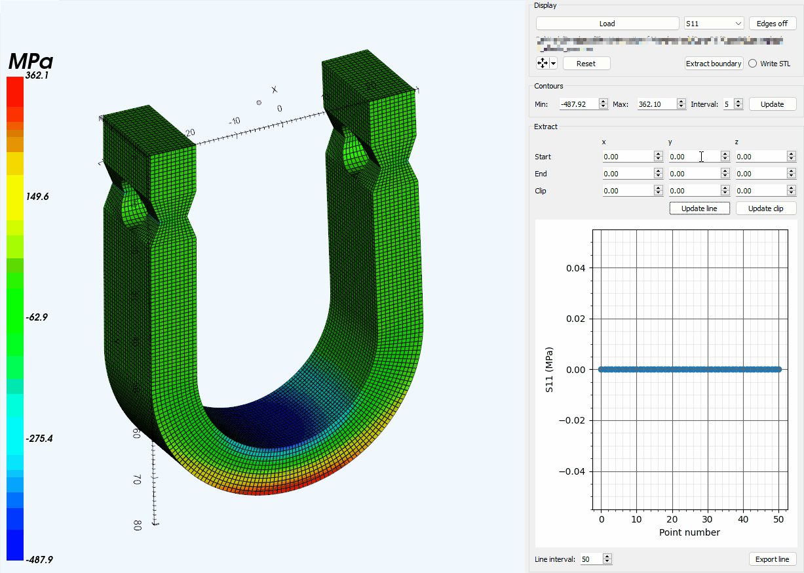

# Model viewer

This application can be launched outside of the main application by running the following at the command line:

~~~
python -m OpenRS.model_viewer
~~~

## Display panel
Once launched, pressing the `Load` button will open a file dialog to open a `*.vtu` or `*.vtp` file. The `*.vtu` file needs to contain an ASCII-XML VTK unstructured mesh, with stress data entered as VTK PointData DataArrays - see `OpenRS\examples` to see what this format looks like, along with VTK documentation. These files can be generated directly from commercial or open source finite element analysis software - see [examples](examples.md). The `*.vtp` file results from using or adapting the translation functionality from results files corresponding to those which employ a structured mesh, but without element connectivity - see [result translations](translations.md).

On loading, the viewer will update with the fields that were incorporated into the `*.vtu` or `*.vtp` file.

Selecting each of the different fields incorporated can be viewed by the drop-down combobox. The model can be navigated by left clicking on the left-hand interaction space, and then further left clicking and dragging to rotate, right clicking and dragging to zoom (or mouse-wheel) and middle button and dragging for panning. This is shown here:

The model's origin can be translated *not rotated* with the tool located in the `Display` panel. The origin can be specified directly, or a vertex from the model itself can be selected. This latter functionality is shown here:

The translation can be undone by pressing `Reset`. The surface data of `*.vtu`-type data can be generated with the `Extract Boundary` button, and a corresponding `*.stl` file can be saved with the `Write STL` radio button selected.

## Extract panel
Stresses as they appear along a line can be extracted in the `Extract` panel. The line is defined with the `Start` x, y, and z values, along with the `End` x, y and z values. Clicking the `Update line` button will update both the model interaction panel on the left by showing this line in purple, and generate a plot on the right of the stress that occurs over this line. The number of points to extract over the line length defaults to 50, but can be changed with the `Interval` selection. In order to see internal features, a clipping plane can be specified with the three points comprising `Start`, `End` and `Clip`. The following shows an example of this:

Note that the algorithm for doing so has been optimized for `*.vtu` or grids, the `*.vtp` results which comprise unregistered points utilizes a 3D interpolation calculation which utilizes every point included and is therefore slow.

The line definition and resulting plot is updated by clicking the `Extract` button again after changes, which will in turn update the interaction and plot. Deactivate clipping by specifying 0,0,0 for `Clip`. Clicking on the `Export` button opens a file dialog to permit saving the data immediately displayed in the plot as a `*.csv` file.